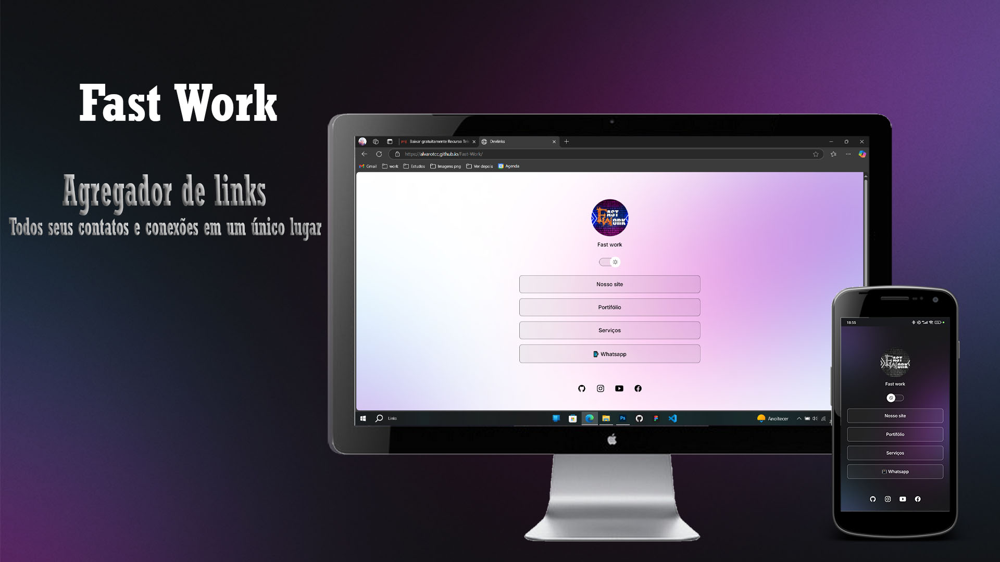

<h1 align="center"> Page Home </h1>

Primeiro site criado por mim dentro da plataforma de estudos academico.  

  <a href="#-tecnologias">Tecnologias</a>&nbsp;&nbsp;&nbsp;|&nbsp;&nbsp;&nbsp;
  <a href="#-projeto">Projetos</a>&nbsp;&nbsp;&nbsp;|&nbsp;&nbsp;&nbsp;
  <a href="#-layout">Layouts</a>&nbsp;&nbsp;&nbsp;|&nbsp;&nbsp;&nbsp;
  <a href="#memo-licença">Licenças</a>

  

 

  

## 🚀 Tecnologias

Esse projeto foi desenvolvido com as seguintes tecnologias:

- HTML e CSS
- JavaScript
- Git e Github
- Figma

## 💻 Projeto

O DevLinks é um agregador de links para usar como cartão de visitas online.

## 🔖 Layout

Você pode visualizar esse site dentro [DESSE LINK](https://alvarotcc.github.io/Fast-Work). E tambem ficar por dentro de novidades no nosso [perfil do instagram](https://www.instagram.com/fastworksolutions).

## ✔ Licença

Esse projeto está sob a licença MIT.

---

Feito com ♥ by FastWork 
👍 [Curta nossas paginas!](https://www.instagram.com/fastworksolutions)
